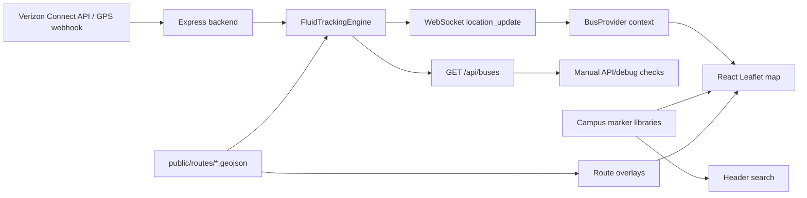

# Architecture Overview

This project is a map-first campus transportation tracker for Bloomsburg. It combines static campus data with live Verizon Connect vehicle data and renders it as a React/Leaflet application.

The codebase is split into two applications:

- `src/` contains the Create React App frontend.
- `server/` contains the TypeScript Express backend.

## Runtime Flow

## Frontend Responsibilities

`src/App.tsx` is the main coordinator. It owns map-wide state such as visible overlays, bus status filters, tracking mode, zoom level, selected markers, and current focus target. The component does not fetch bus data itself; it reads live bus state from `BusProvider`.

`src/components/bus.tsx` opens the WebSocket connection to `ws://localhost:3001` and stores the latest `location_update` payload in React context. This keeps the transport layer separate from the map rendering logic.

`src/components/Header.tsx` provides the campus search flow. It builds one searchable list from academic, recreation, housing, dining, and transit marker libraries. Duplicate location names are collapsed into one result so selecting a result always focuses one intended marker.

`src/components/SubHeader.tsx` is the map control panel. It manages local UI state for overlay toggles, route subfilters, bus status filters, and the fluid/ping tracking selector, then reports those choices back to `App.tsx`.

`src/components/MapViewportController.tsx` contains the map camera behavior. It clamps focused centers inside the configured map bounds, opens selected popups reliably after search, and recenters popup content so cards are not cut off.

`src/components/routes/*.tsx` load static route GeoJSON from `public/routes/`. Route files are static assets so the client can show overlays even when live vehicle data is unavailable.

## Backend Responsibilities

`server/src/server.ts` owns the Express app, REST endpoints, WebSocket server, polling startup, webhook endpoint, route-file loading, and graceful shutdown.

`server/src/VZConnectAPICalls.ts` is the Verizon Connect integration. It handles token refresh, vehicle discovery, single-vehicle location lookup, fleet polling, status normalization, and webhook parsing.

`server/src/BusRoute.ts` models route geometry. It can project a GPS point onto a route, report the nearest progress along that route, and interpolate a coordinate from a progress distance.

`server/src/FluidTracking.ts` is the smoothing engine. It stores short per-bus histories, derives an adaptive playback delay from recent update intervals, route-locks movement when a bus is close enough to a known route, and emits display locations for the frontend.

## Tracking Modes

The backend sends both raw ping data and smoothed fluid data in each bus object.

- `ping` mode displays the latest raw provider coordinates.
- `fluid` mode displays delayed, smoothed coordinates from `FluidTrackingEngine`.

Fluid mode is the default because it reduces visible jumping between 20-40 second provider updates. Ping mode remains useful for debugging the raw GPS source.

## Route Locking

Route locking uses the GeoJSON files in `public/routes/`:

- `campus-loop.geojson`
- `downtown-loop.geojson`
- `walmart-trip.geojson`

When a bus is close enough to one of these routes, smoothing interpolates along the route path instead of drawing a straight line between GPS pings. This keeps the bus visually on the road and avoids rubber-band movement around route curves.

## Status Handling

Verizon Connect status and speed can be stale or conservative. The backend preserves raw provider fields as `pingStatus`, `pingSpeed`, and related ping values, but the display status may be upgraded to `Moving` when the smoothing engine detects meaningful movement between samples.

The UI intentionally does not show provider speed or heading because those values can disagree with the delayed smoothed representation.

## Failure Behavior

The map should remain usable when one layer fails:

- If the backend is down, static campus markers and route overlays can still render.
- If a route GeoJSON file is missing, the corresponding route overlay and route-lock smoothing may be unavailable, but live buses can still display.
- If one Verizon vehicle location request fails, polling logs the skipped vehicle and continues with the rest of the fleet.
- If a smoothed sample becomes invalid, the smoothing engine falls back to the last known display location until the bus ages out.

## Maintenance Notes

- New React UI files should use `.tsx`.
- Shared non-React frontend utilities should use `.ts`.
- Shared frontend data shapes should live in `src/types/frontend.ts`.
- `src/setupProxy.js` stays JavaScript because Create React App loads it as a CommonJS development-server hook.
- Avoid `npm audit fix --force` on the root app. Create React App relies on older transitive packages; forced audit fixes can replace `react-scripts` with incompatible versions and break `npm start`.
